# AVPlayer

基于 FFmpeg + SDL2 的跨平台音视频播放器，架构参考 ffplay 实现。

## 类图

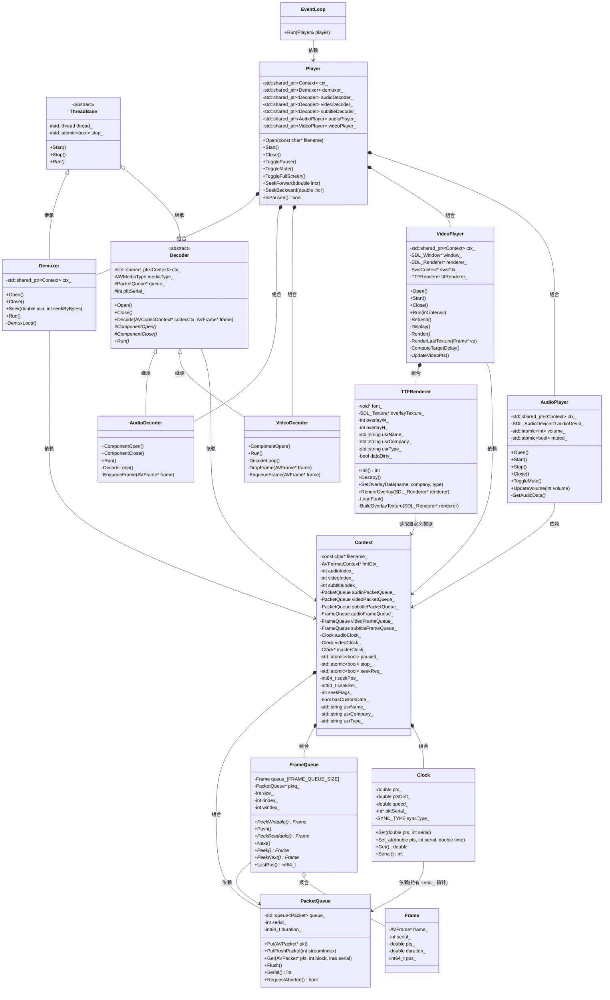

### 类图关系说明

| 关系符 | 含义 | 涉及类 |
|--------|------|--------|
| `<--` | 继承 | `ThreadBase` → `Demuxer`、`Decoder`；`Decoder` → `AudioDecoder`、`VideoDecoder` |
| `*--` | 组合（生命周期一致） | `Player` 持有各模块实例；`Context` 持有队列和时钟；`VideoPlayer` 持有 `TTFRenderer` |
| `o--` | 聚合（生命周期独立） | `FrameQueue` 聚合 `Frame`（环形缓冲区） |
| `-->` | 依赖（仅引用） | `Demuxer`/`Decoder`/`Player` 通过 `shared_ptr<Context>` 访问；`FrameQueue` 引用 `PacketQueue` 的 serial；`TTFRenderer` 经 `VideoPlayer` 间接读取 `Context` 的自定义数据字段 |

---

## Seek 流程

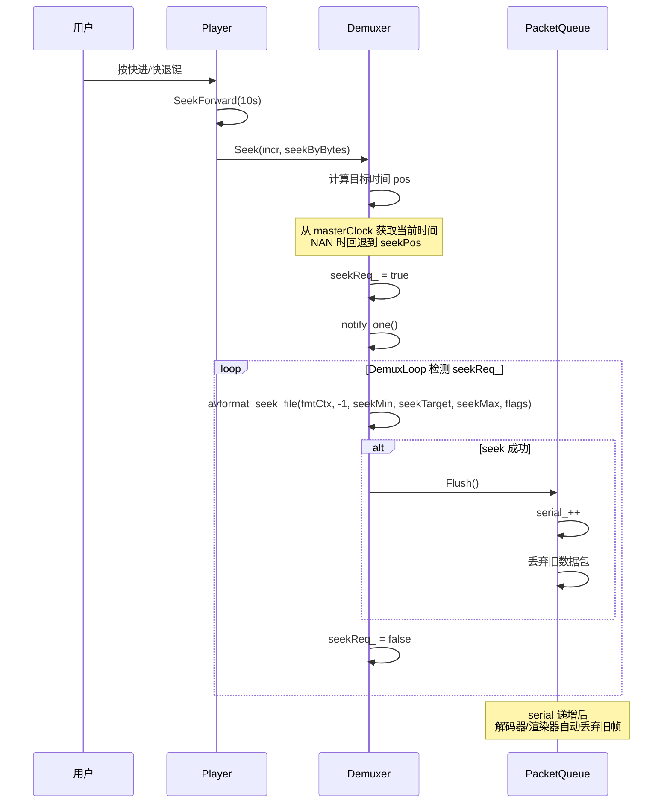

---

## 暂停/恢复流程

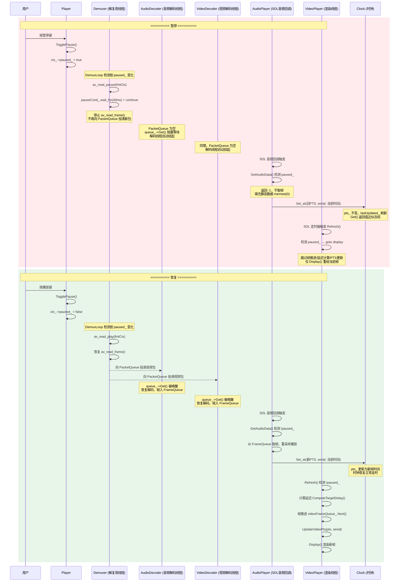

# AVPlayer 主流程架构图

> 主要数据流与线程模型

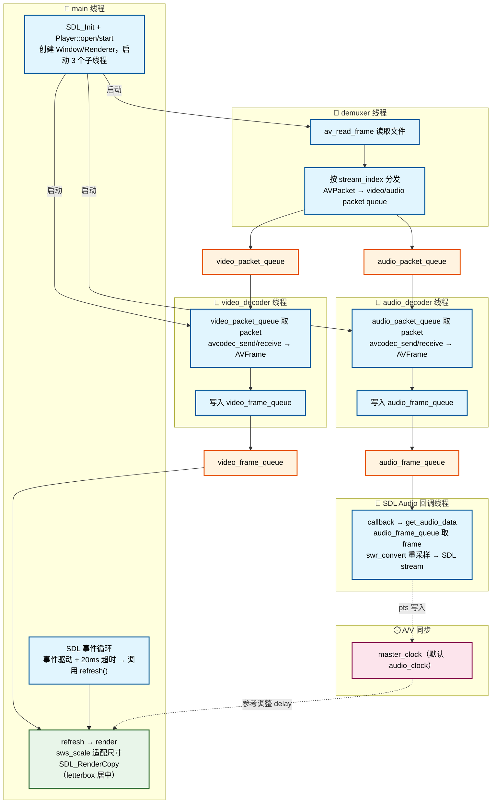

***

# 音视频同步时序图

> 以音频时钟为 master clock，视频追音频。关键流程。

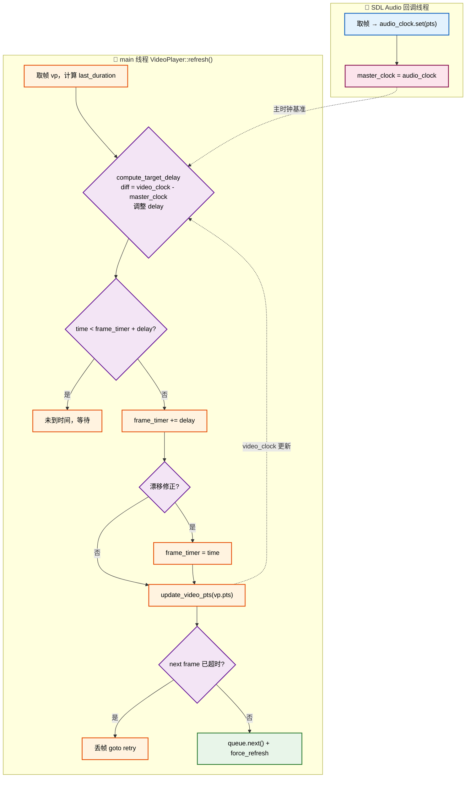

## 关键代码位置

| 步骤                 | 类 + 函数                              |
| ------------------ | ----------------------------------- |
| 音频写主时钟             | `AudioPlayer::get_audio_data`       |
| A/V 同步调整 delay     | `VideoPlayer::compute_target_delay` |
| 判断显示时机 + 漂移修正 + 丢帧 | `VideoPlayer::refresh`              |
| 视频时钟写入             | `VideoPlayer::update_video_pts`     |

***

# 暂停与恢复流程图

> 暂停时音频设备不停，输出静音；时钟冻结；解封装阻塞；视频渲染保持当前帧。
> 恢复时各线程同步唤醒，时钟恢复递增。

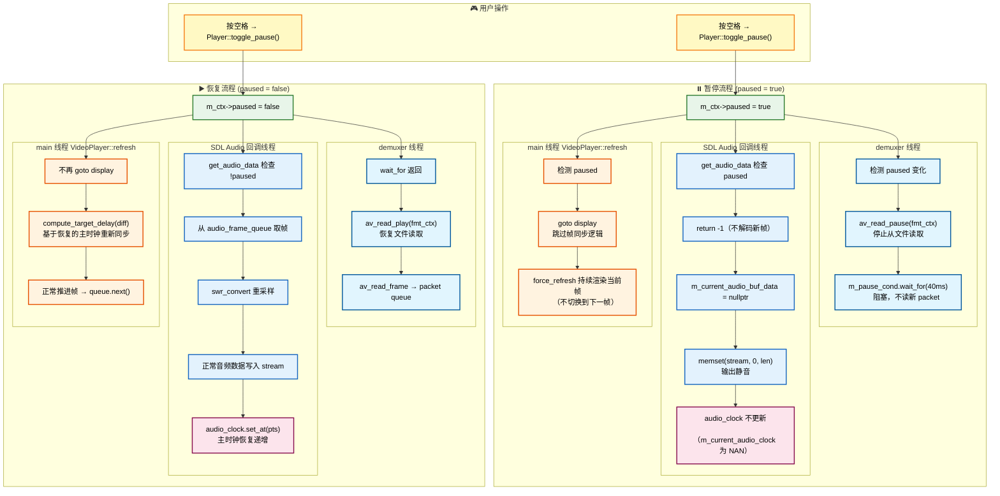

## 关键设计点

| 层               | 暂停时                           | 恢复时                           |
| --------------- | ----------------------------- | ----------------------------- |
| **Demuxer**     | `av_read_pause` + 条件变量阻塞 40ms | `av_read_play` + 唤醒继续读 packet |
| **Audio 设备**    | **不停**，持续回调                   | 正常输出音频数据                      |
| **Audio 输出**    | `memset(stream, 0)` 静音        | 从帧队列取数据重采样输出                  |
| **Audio Clock** | 不更新，返回固定 `m_pts`              | `set_at(pts)` 恢复递增            |
| **Video 渲染**    | `goto display`，渲染当前帧不切换       | 正常走同步逻辑，推进帧                   |

## 关键代码位置

| 步骤      | 类 + 函数                                             |
| ------- | -------------------------------------------------- |
| 暂停状态切换  | `Player::toggle_pause`                             |
| 解封装暂停   | `Demuxer::demux_loop`                              |
| 音频静音输出  | `AudioPlayer::run` + `AudioPlayer::get_audio_data` |
| 视频保持当前帧 | `VideoPlayer::refresh`                             |
| 时钟冻结    | `Clock::get`                                       |

***

# Seek 跳转流程图

> 基于 serial 机制，确保 seek 后旧数据（packet / decoder 缓存 / frame）被正确丢弃。
> 涉及主线程（请求）、demuxer 线程（执行）、解码线程（flush）、播放线程（过滤旧帧）四个阶段。

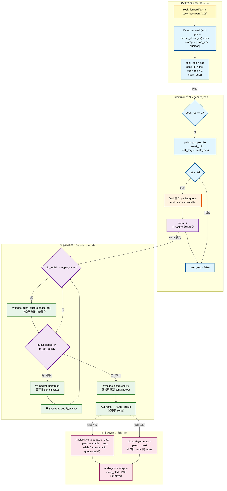

## serial 机制详解

> serial 是 seek 正确性的核心保障，贯穿 packet queue → decoder → frame queue → 播放端全链路。

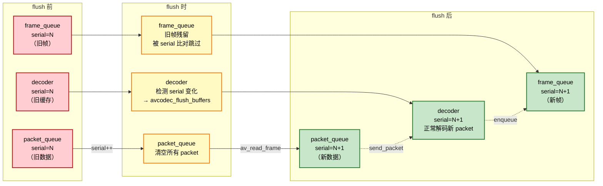

## 关键代码位置

| 步骤                       | 类 + 函数                        |
| ------------------------ | ----------------------------- |
| 计算目标位置 + 设置请求            | `Demuxer::seek`               |
| 执行 seek + flush queue    | `Demuxer::demux_loop`         |
| 清空队列 + serial 递增         | `PacketQueue::flush`          |
| 检测 serial 变化 + flush 解码器 | `Decoder::decode`             |
| 音频跳过旧帧                   | `AudioPlayer::get_audio_data` |
| 视频跳过旧帧                   | `VideoPlayer::refresh`        |

***

# 自定义数据 + TTF 叠加渲染设计

> 从 MP4 内嵌的 DATA 流(`AVMEDIA_TYPE_DATA` + `AV_CODEC_ID_BIN_DATA`)按帧读取 JSON 文本,由 `DataPlayer` 解析成文本行并按 PTS 入队,`VideoPlayer` 用 ffplay 字幕式同步算法取当前生效帧,通过 SDL_ttf 渲染半透明叠加层,绘制到画面右上角。播放器运行期不依赖任何外部 metadata 解析,数据完全来自媒体文件本身的轨道。

## 整体数据流

```mermaid
flowchart LR
    classDef write fill:#fff9c4,stroke:#f57f17,stroke-width:2px,color:#000
    classDef file fill:#e8f5e9,stroke:#1b5e20,stroke-width:2px,color:#000
    classDef demux fill:#e3f2fd,stroke:#1565c0,stroke-width:2px,color:#000
    classDef data fill:#f3e5f5,stroke:#6a1b9a,stroke-width:2px,color:#000
    classDef sync fill:#fce4ec,stroke:#880e4f,stroke-width:2px,color:#000
    classDef sdl fill:#ffe0b2,stroke:#e65100,stroke-width:2px,color:#000

    subgraph Write["写入端(离线工具,不参与编译)"]
        W1["json_stream_data.h
CreateJsonStreamMP4()"]:::write
        W2["avformat_new_stream(DATA)
codec_id = BIN_DATA
time_base = 1/fps"]:::write
        W3["每个视频帧 → JSON 包
av_interleaved_write_frame"]:::write
        W1 --> W2 --> W3
    end

    MP4[("MP4 文件
内含 DATA 流(BIN_DATA)
payload = JSON 文本")]:::file

    subgraph Demux["Demuxer::DemuxLoop"]
        D1["av_read_frame"]:::demux
        D2{"stream_index
分发"}:::demux
        D3["video/audio/subtitle
→ 各 PacketQueue"]:::demux
        D4["dataIndex_
→ dataPacketQueue_.Put"]:::demux
        D1 --> D2
        D2 --> D3
        D2 --> D4
    end

    subgraph DP["DataPlayer 线程"]
        P1["dataPacketQueue_.Get(pkt, serial)"]:::data
        P2["去重: 相同 dataId 丢弃
防 overlay 跳变"]:::data
        P3["json::parse → 取字段"]:::data
        P4["构建文本行
ID/Value/Speed/Temp/Msg/Lon/Lat"]:::data
        P5["dataFrameQueue_.Push
带 pts + serial"]:::data
        P1 --> P2 --> P3 --> P4 --> P5
    end

    subgraph VP["VideoPlayer(main 线程)"]
        V1["UpdateDataOverlay(vp)
ffplay 字幕式同步:
staleSerial/nextReady 清理
PTS 到点 → SetStreamLines"]:::sync
        V2["RenderStreamOverlay
脏标志 + Texture 缓存
右上角 RenderCopy"]:::sync
        V3["SDL_RenderPresent"]:::sdl
        V1 --> V2 --> V3
    end

    W3 --> MP4
    MP4 --> D1
    D4 --> P1
    P5 --> V1
```

## DATA 流包结构

写入端 [json_stream_data.h](file:///d:/software/VisualStudio/code/CustomData/CustomMetadata/json_stream_data.h) 的 `CreateJsonStreamMP4()` 在源 MP4 基础上新增一条 DATA 流:

| 流属性 | 值 |
|---|---|
| `codec_type` | `AVMEDIA_TYPE_DATA` |
| `codec_id` | `AV_CODEC_ID_BIN_DATA` |
| `codec_tag` | 0 |
| `time_base` | `av_inv_q(frameRate)`(与视频帧率倒数,如 1/24) |

每个视频帧对应一个 DATA 包,包内 payload 为 JSON 文本,字段如下:

| 字段 | 类型 | 含义 | 示例 |
|---|---|---|---|
| `frame` | int64 | 视频帧序号(0-based) | 0, 1, 2... |
| `pts` | int64 | 视频原始 pts(参考用,播放端不直接用) | 0, 1001, 2002... |
| `time_ms` | int64 | 该帧对应的墙钟时间(ms) | 0, 42, 83... |
| `data_id` | int64 | 数据分组 ID(每 0.5s 变一次) | 0, 0, 0..., 1, 1... |
| `value` | int64 | 业务值 | 1000, 1001... |
| `speed` | double | 速度 | 60.0, 60.5... |
| `temperature` | double | 温度 | 20.0, 20.5... |
| `message` | string | 消息文本 | "test_data_0" |
| `longitude` | double | 经度 | 116.123456 |
| `latitude` | double | 纬度 | 39.123456 |

包级别字段:

| 字段 | 值 | 说明 |
|---|---|---|
| `pts` / `dts` | `dataPts++`(按帧递增:0,1,2...) | DATA 流自身序号,与视频 pts 不同基 |
| `duration` | 1 | 占一个 time_base 单位 |
| `pos` | -1 | 无字节位置 |

### 同步时间来源

`DataPlayer::GetDataPacket` 计算叠加层 PTS 的优先级:

1. 优先用 JSON 内 `time_ms / 1000.0`(墙钟秒,与视频 pts 同基)
2. 回退用 `pkt->pts * av_q2d(dataStream_->time_base)`(DATA 流 pts × time_base)

> 用 `time_ms` 作为主基准,是为了让叠加层 PTS 与 `videoClock_` 直接同基(均为秒),无需 time_base 换算。DATA 流自身 pts 仅作回退。

### data_id 与去重

写入端 `data_id = (int64_t)(timeSeconds / 0.5)`,即每 0.5 秒一个 ID。读取端 `DataPlayer` 丢弃与上次相同 `data_id` 的包(只保留每个 ID 的第一帧),避免在 24fps 下同一组数据被反复下发导致 overlay 跳变。

### 写入端独立性

`CustomMetadata/` 目录仅含 `json.hpp`(nlohmann/json 头文件库) 与 `json_stream_data.h`(参考脚本),两者**不参与播放器编译**,仅作为离线生成 MP4 的工具:`CreateJsonStreamMP4()` 读取 `D:\tmp\walking-dead.mp4`,输出 `D:\tmp\walking-dead-json-stream.mp4` 与 `D:\tmp\data.json`(参考转储)。播放器只消费最终的 MP4 文件。

## 字体加载策略

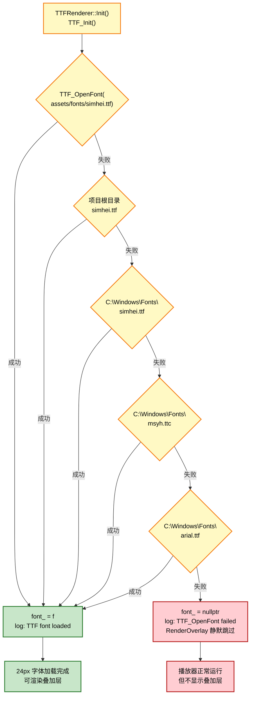

### Fallback 设计原则

| 优先级 | 路径 | 适用场景 |
|---|---|---|
| 1 | `assets/fonts/simhei.ttf` | 项目内打包,跨机器可复现(推荐) |
| 2 | 项目根目录 `simhei.ttf` | 开发期临时放置 |
| 3 | `C:\Windows\Fonts\simhei.ttf` | Windows 系统字体 |
| 4 | `C:\Windows\Fonts\msyh.ttc` | 微软雅黑(中文兜底) |
| 5 | `C:\Windows\Fonts\arial.ttf` | 英文兜底(中文会显示方块) |

**字体大小**:固定 24px,通过 `TTF_OpenFont(path, 24)` 加载。

## Texture 缓存机制

> DATA 流叠加层的内容随 PTS 实时变化(每帧由 `UpdateDataOverlay` 从 `dataFrameQueue_` 取出当前生效的 JSON 行下发),但相邻帧内容往往相同(同一 `dataId` 期间复用)。为避免每帧重复 `TTF_RenderUTF8_Blended`(开销大),采用脏标志 + Texture 缓存:仅当 `streamLines_` 内容变化时重建 `streamTexture_`,否则直接复用。

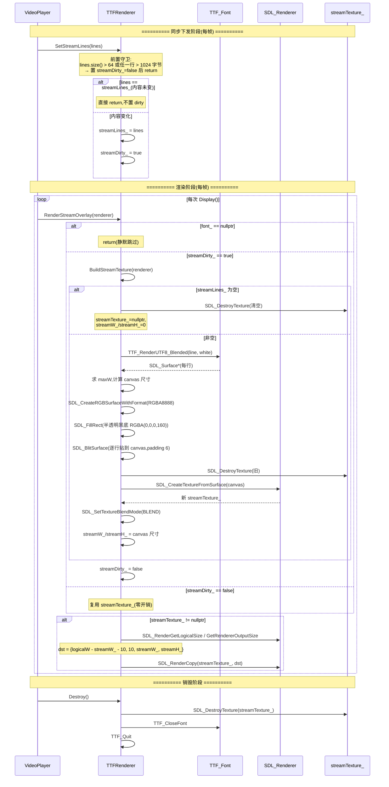

### 叠加层视觉规格

| 属性 | 值 |
|---|---|
| 位置 | 右上角 `{logicalW - streamW_ - 10, 10}`(logical 优先,fallback 到 output size) |
| 字体大小 | 24px |
| 文字颜色 | 白色 `RGBA(255,255,255,255)` |
| 背景色 | 半透明黑 `RGBA(0,0,0,160)` |
| 混合模式 | `SDL_BLENDMODE_BLEND`(Texture 级) |
| 内边距 | 6px |
| 行间距 | `TTF_FontHeight(f)` |
| 内容守卫 | 行数 ≤ 64,单行字节 ≤ 1024,超出则放弃重建 |
| Canvas 格式 | `SDL_PIXELFORMAT_RGBA8888` |
| 显示内容 | DATA 流 JSON 解析所得: `ID/Value/Speed/Temp/Msg/Lon/Lat`(由 `DataPlayer::GetDataPacket` 构建) |
| 数据来源 | `dataFrameQueue_` 当前帧的 `Frame::dataLines_`(经 `UpdateDataOverlay` 同步过滤后下发) |

## 关键代码位置

| 步骤 | 文件 + 函数 |
|---|---|
| 写入 metadata(离线) | `CustomMetadata/json_data.h` / `proto_data.h` |
| 读取 metadata + 解析 | `CustomMetadata/custom_data.cpp: ParseCustomDataFromJson / ParseCustomDataFromProtobuf` |
| 宏分发入口 | `CustomMetadata/custom_data.h: ParseCustomData` |
| 写入 Context | `AVPlayer/src/player.cpp: Player::Open` |
| 传给 TTFRenderer | `AVPlayer/src/video_player.cpp: VideoPlayer::Open` |
| TTF 初始化 + 字体加载 | `AVPlayer/src/ttf_renderer.cpp: TTFRenderer::Init / LoadFont` |
| Texture 构建 | `AVPlayer/src/ttf_renderer.cpp: BuildOverlayTexture` |
| 每帧叠加渲染 | `AVPlayer/src/ttf_renderer.cpp: RenderOverlay` |
| 调用叠加渲染 | `AVPlayer/src/video_player.cpp: VideoPlayer::Display / RenderLastTexture` |
| 资源释放 | `AVPlayer/src/ttf_renderer.cpp: TTFRenderer::Destroy` |

